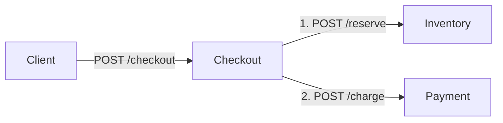

# Aegis

Aegis is a planned Distributed Resilience Intelligence Platform: it will observe distributed applications, detect abnormal behavior, reconstruct dependencies and failure propagation, rank likely root causes, and investigate evidence. ChaosBench will eventually supply controlled faults for evaluation.

**Batch 1 implements ShopSim, the small test environment that Aegis will monitor. The Aegis platform itself is not implemented yet.**

ShopSim consists of three independent Go HTTP services. For each valid checkout, Checkout calls Inventory to make a mock reservation, waits for success, then calls Payment to make a mock charge. Both results return to the client.



## Prerequisites and quick start

- Go 1.27.1 (the module requires 1.27.1 or newer in the 1.27 series).
- Docker Engine or Docker Desktop running Linux containers, with Docker Compose.
- Free host ports 8080, 8081 and 8082.

From the repository root:

```sh
go fmt ./...
go vet ./...
go test ./...
go build ./...
docker compose config
docker compose build
docker compose up -d --wait
```

Go uses one module and only the standard library. Docker packages the independently built Go executables. Multi-stage images run as an unprivileged user. Compose caps each service at 128 MiB RAM and 0.5 CPU; the three runtime limits total 384 MiB. Docker Desktop and image builds require additional memory.

| Service | Host URL | Internal Compose URL | Operation |
| --- | --- | --- | --- |
| Checkout | http://localhost:8080 | http://checkout:8080 | POST /checkout |
| Payment | http://localhost:8081 | http://payment:8080 | POST /charge |
| Inventory | http://localhost:8082 | http://inventory:8080 | POST /reserve |

All services expose `GET /healthz`, returning `{"status":"ok"}`. Health is process liveness, not downstream readiness. Compose waits for downstream health at startup. Its default network supplies service DNS. Inside a container, localhost refers to that same container. Ports are published on host loopback only.

PowerShell example:

```powershell
8080,8081,8082 | ForEach-Object { Invoke-RestMethod "http://localhost:$_/healthz" }
$body = '{"order_id":"order-123","sku":"sku-001","quantity":1,"amount_cents":2500}'
Invoke-RestMethod -Method Post -Uri http://localhost:8080/checkout -ContentType application/json -Body $body | ConvertTo-Json -Depth 4
```

POSIX shell example:

```sh
curl -sS http://localhost:8080/healthz
curl -sS http://localhost:8081/healthz
curl -sS http://localhost:8082/healthz
curl -sS http://localhost:8080/checkout -H 'Content-Type: application/json' \
  -d '{"order_id":"order-123","sku":"sku-001","quantity":1,"amount_cents":2500}'
```

Successful response (HTTP 200):

```json
{
  "order_id": "order-123",
  "status": "completed",
  "inventory": {
    "order_id": "order-123",
    "status": "reserved",
    "reservation_id": "reservation-order-123"
  },
  "payment": {
    "order_id": "order-123",
    "status": "charged",
    "payment_id": "payment-order-123"
  }
}
```

Inspect request logs and stop the environment:

```sh
docker compose logs
docker compose down
```

## API and configuration

Inventory accepts `order_id`, `sku`, and positive integer `quantity`. Payment accepts `order_id` and positive integer `amount_cents`. Checkout accepts all four fields. IDs and SKU must not be blank. Results are deterministic mock IDs derived from the order ID; no records are stored.

Bodies are limited to 64 KiB. Malformed JSON, unknown fields, multiple JSON values, and invalid fields return HTTP 400 with `{"error":"..."}`. Unsupported methods return 405; unknown paths return 404. Downstream connection failures, non-2xx responses, and invalid success payloads return 502. Downstream timeouts return 504. Error bodies omit internal details; logs record failures.

Checkout uses a two-second timeout per downstream call, propagates request cancellation, and does not follow redirects or retry calls. Its downstream origins are required environment variables:
- `INVENTORY_URL`, for example `http://localhost:8082`.
- `PAYMENT_URL`, for example `http://localhost:8081`.

All services support `LISTEN_ADDR` (default `:8080`). To run without Docker, open three terminals at the repository root. In PowerShell:

```powershell
# Terminal 1
$env:LISTEN_ADDR = ':8082'
go run ./shopsim/inventory
# Terminal 2
$env:LISTEN_ADDR = ':8081'
go run ./shopsim/payment
# Terminal 3
$env:LISTEN_ADDR = ':8080'
$env:INVENTORY_URL = 'http://localhost:8082'
$env:PAYMENT_URL = 'http://localhost:8081'
go run ./shopsim/checkout
```

## Boundaries and next stages

V0 has no persistence, stock accounting, actual money movement, transactional rollback, or idempotency store. Payment failure occurs after a mock reservation; a timeout does not prove the downstream operation never happened. Repeated requests generate the same IDs but still execute the calls. Do not treat this as an ecommerce backend.

The request's downstream calls are deliberately sequential; the standard HTTP server can still serve independent clients concurrently.

PostgreSQL, Redis, OpenTelemetry/OTLP, Collector, telemetry storage, messaging, ChaosBench, analysis/ML, root-cause ranking, AI/LLMs, control plane, frontend, authentication, retries, circuit breakers, Kubernetes, Terraform and cloud deployment are outside this batch.

See [architecture v0](docs/architecture/architecture-v0.md) and the [ADRs](docs/adr). Tests use standard-library HTTP test servers and require no containers.

