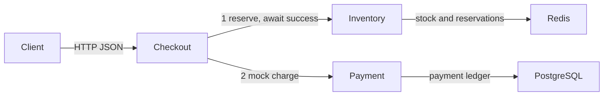
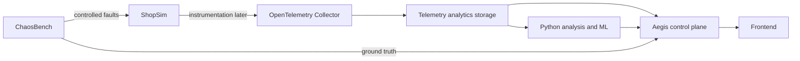

# Architecture v0

## Implemented through Batch 2

Aegis currently contains ShopSim only: three independently executable Go services in one module, built into separate containers and connected through Docker Compose's default network.

Checkout owns orchestration. Inventory receives order ID, SKU and quantity and reserves real stock in Redis. Payment receives order ID and amount in cents only after reservation success, then records a fake charge in PostgreSQL. Each returns an order-correlated result with a stable derived ID. Checkout returns both results, or a JSON error. There are no cross-service function imports; only small HTTP I/O conventions are shared.

The calls are synchronous and sequential, with a two-second client timeout for each downstream. No automatic retries, concurrent downstream fan-out, or circuit breakers exist. Server read/write deadlines bound request handling. Liveness checks do not recursively inspect dependencies.

The environment is designed for a roughly 16 GB laptop. Go services and Redis each have a 128 MiB limit; PostgreSQL has 256 MiB. Every service has a half-CPU limit, with 768 MiB total runtime memory limits. Actual Docker VM/build memory depends on the developer's setup. Host ports 8080–8082 expose the applications on loopback. Datastores are accessible only on the Compose network. Environment variables supply connection settings. Each storage client has at most four active connections and each request's storage operation has a one-second context deadline.

PostgreSQL's `payments` table has an `order_id` primary key, positive `amount_cents`, `charged` status, and creation timestamp. An INSERT with ON CONFLICT DO NOTHING enforces one ledger row per order. A separate read compares the committed winner's amount; exact replays succeed without modifying the row and changed amounts return 409. The application never deletes or updates ledger rows. Initialization SQL runs on first creation of the named PostgreSQL volume; later changes require explicit schema evolution.

Redis holds `stock:<sku>` integer keys and `reservation:<order_id>` hashes with SKU and quantity. SETNX seeds missing stock keys only. WATCH covers both keys, followed by a MULTI/EXEC transaction that updates stock and creates the reservation together. Exact replays return existing results; changed details and insufficient stock return 409. Unknown SKUs return 404. At most eight optimistic transaction attempts are allowed within the request deadline; only WATCH aborts are retried. This follows the [go-redis transaction pattern](https://redis.io/docs/latest/develop/clients/go/transpipe/). Redis transactions do not roll back arbitrary runtime command errors; key ownership, validated state and available capacity remain assumptions.

Redis uses AOF with every-second fsync, a named volume, and no eviction. Normal restarts preserve both stores. Abrupt host loss can lose recent Redis writes. Independent store loss/restore can break cross-store consistency. Redis is chosen to create a distinct experimental dependency and failure mode, not as a universal production inventory architecture.

All `/healthz` endpoints check process liveness only. Payment and Inventory `/readyz` endpoints ping their stores with bounded deadlines and return 503 if unavailable. Readiness does not verify schema, capacity, or business stock. Checkout keeps its existing liveness endpoint; Compose waits for downstream readiness at startup. Runtime failures still return controlled JSON errors. Checkout propagates downstream 409 conflicts and maps other downstream failures to 502 or timeout to 504.

Reservation success followed by Payment failure leaves stock reserved. Checkout logs the order ID and retained reservation; an exact manual replay may finish after recovery without decrementing twice. There is no shared transaction, reservation expiration/release, Saga, automatic compensation, or HTTP retry. Per-service idempotency does not imply atomic checkout. This explicit limitation supplies a future Aegis failure scenario.

## Intended later architecture — not implemented

Future OpenTelemetry instrumentation will export metrics, logs and traces through an OpenTelemetry Collector to analytics storage. A later Aegis control plane will coordinate dependency reconstruction, incident evidence, root-cause ranking and tool-using AI investigation. Python analysis/ML components will support detection and ranking. A frontend will present findings and evidence.

ChaosBench will introduce controlled faults and provide ground truth for evaluation. Telemetry analytics products, monitoring interfaces, fault controls and deployment requirements are not implemented or finalized here. No directories or services for these future components are scaffolded. The PostgreSQL and Redis dependencies shown in the current diagram already exist; Aegis monitoring does not.

ShopSim is the evaluation target, not the primary portfolio product. Each future stage should be separately implemented and validated against explicit learning objectives.
