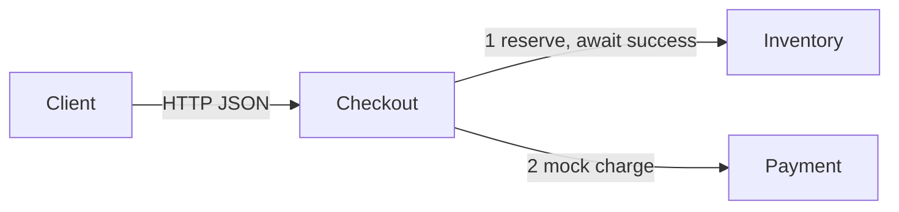
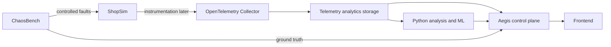

# Architecture v0

## Implemented in Batch 1

Aegis currently contains ShopSim only: three independently executable Go services in one module, built into separate containers and connected through Docker Compose's default network.

Checkout owns orchestration. Inventory receives order ID, SKU and quantity. Payment receives order ID and amount in cents only after reservation success. Each downstream returns an order-correlated deterministic mock result. Checkout returns both results, or a JSON error. There are no cross-service function imports; only small HTTP I/O conventions are shared.

The calls are synchronous and sequential, with a two-second client timeout for each downstream. No automatic retries, concurrent downstream fan-out, or circuit breakers exist. Server read/write deadlines bound request handling. Liveness checks do not recursively inspect dependencies.

The environment is designed for a roughly 16 GB laptop. Each container is limited to 128 MiB and half a CPU. Actual Docker VM/build memory depends on the developer's setup. The public entry point is host port 8080; 8081 and 8082 expose downstreams for local inspection. All published ports bind to loopback.

Mock services are stateless. There is no stock decrement, charge ledger, compensation, or durable idempotency. A partial failure may follow reservation success. These semantics will need deliberate design if stateful dependencies are added.

## Intended later architecture — not implemented

Future OpenTelemetry instrumentation will export metrics, logs and traces through an OpenTelemetry Collector to analytics storage. A later Aegis control plane will coordinate dependency reconstruction, incident evidence, root-cause ranking and tool-using AI investigation. Python analysis/ML components will support detection and ranking. A frontend will present findings and evidence.

ChaosBench will introduce controlled faults and provide ground truth for evaluation. PostgreSQL behind Payment and Redis behind Inventory are intended later dependencies. Storage products, interfaces, fault controls and deployment requirements are not implemented or finalized here. No directories or services for these future components are scaffolded.

ShopSim is the evaluation target, not the primary portfolio product. Each future stage should be separately implemented and validated against explicit learning objectives.

